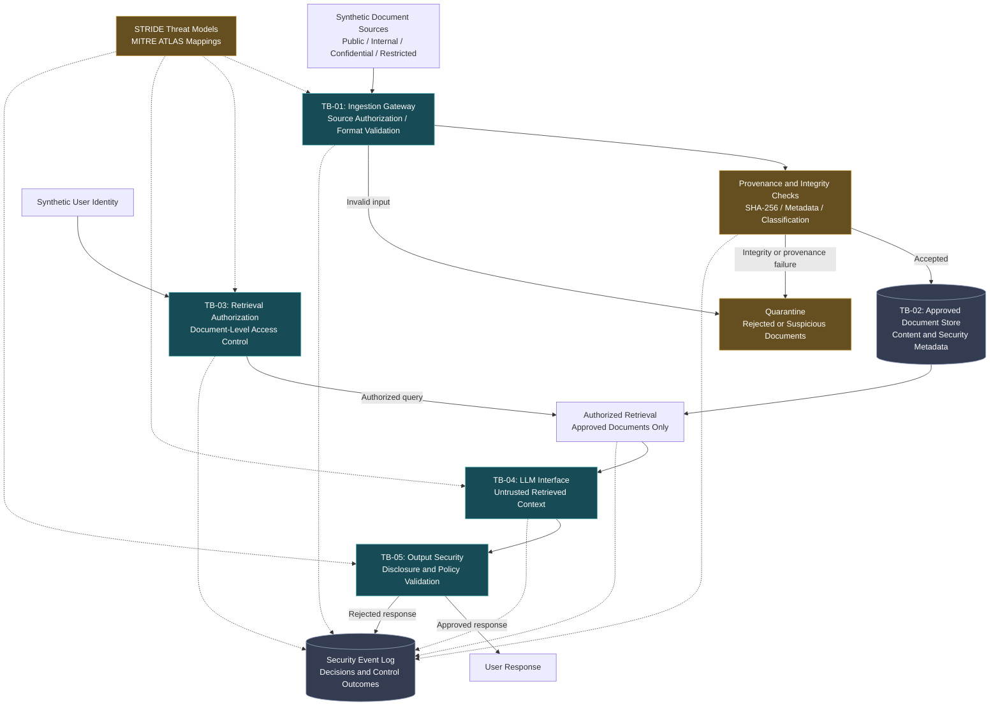

# Secure AI Data and RAG Pipeline — Architecture

```mermaid
flowchart TD
    A["Synthetic Document Sources<br/>Public / Internal / Confidential / Restricted"]
    B["TB-01: Ingestion Gateway<br/>Source Authorization / Format Validation"]
    C["Provenance and Integrity Checks<br/>SHA-256 / Metadata / Classification"]
    Q["Quarantine<br/>Rejected or Suspicious Documents"]
    D[("TB-02: Approved Document Store<br/>Content and Security Metadata")]

    U["Synthetic User Identity"]
    E["TB-03: Retrieval Authorization<br/>Document-Level Access Control"]
    F["Authorized Retrieval<br/>Approved Documents Only"]
    G["TB-04: LLM Interface<br/>Untrusted Retrieved Context"]
    H["TB-05: Output Security<br/>Disclosure and Policy Validation"]
    I["User Response"]

    L[("Security Event Log<br/>Decisions and Control Outcomes")]
    M["STRIDE Threat Models<br/>MITRE ATLAS Mappings"]

    A --> B
    B --> C
    B -->|Invalid input| Q
    C -->|Accepted| D
    C -->|Integrity or provenance failure| Q

    U --> E
    E -->|Authorized query| F
    D --> F
    F --> G
    G --> H
    H -->|Approved response| I
    H -->|Rejected response| L

    B -.-> L
    C -.-> L
    E -.-> L
    F -.-> L
    G -.-> L
    M -.-> B
    M -.-> E
    M -.-> G
    M -.-> H

    classDef boundary fill:#174B55,color:#FFFFFF,stroke:#58B4B4
    classDef storage fill:#343C52,color:#FFFFFF,stroke:#9AA7C4
    classDef security fill:#654F20,color:#FFFFFF,stroke:#D5AE58

    class B,E,G,H boundary
    class D,L storage
    class C,Q,M security
```